<p align="center">
  
</p>

<h1 align="center">GardenRSS</h1>

<p align="center">
  <picture>
    <source media="(prefers-color-scheme: dark)" srcset="web/public/brand/hero-window-planter-dark.svg">
    
  </picture>
</p>

Calm, **local-first RSS feed manager** — tend your subscription garden: Scan health, prune weeds, plant from Catalog, stage on the Deck, export OPML, sync to Miniflux / FreshRSS from Tools.

Not a feed reader — reading happens in your reader; GardenRSS keeps the list evergreen.

## What it does

| Surface | Role |
|--------|------|
| **Garden** | Import / edit / Scan / prune / export OPML (browser IndexedDB) |
| **Catalog** | Curated directory + community collections; stage into Deck |
| **Deck** | Review category mapping, then bulk-import into Garden |
| **Tools** | Connect Miniflux / FreshRSS; push, pull, protected wipe (tokens stay in this browser) |

Personal lists never leave your browser except when **you** call Scan or a reader API (via optional `/api/proxy`).

## Status

Active MVP. Primary host: **Vercel Hobby** at **https://gardenrss.newto.sh** (SPA + serverless Scan / discover / Tools proxy). Local Scan still runs via the Cloudflare Worker package under `workers/scan` for `npm run dev`.

## Layout

| Path | Role |
|------|------|
| `web/` | Vue 3 + Vite SPA |
| `api/` | Vercel Edge functions (`/api/scan`, `/api/discover`, `/api/proxy`) |
| `workers/scan/` | Shared Scan logic + local Wrangler/dev Worker |
| `cmd/gardenrss-crawl/` | Go CLI for directory crawl (CI) |
| `internal/score/` | Shared health + velocity scoring (Go) |
| `data/` | Directory, categories, community sources |
| `docs/plans/` | Product and feature plans |
| `vercel.json` | Vercel build + SPA rewrites |

## Local development

### Prerequisites

- Go 1.21+ (any recent install — `go.mod` pins toolchain 1.26.5, auto-downloaded via `GOTOOLCHAIN=auto`; CI runners install 1.24.x as the base)
- Node.js 22.18+ or 24.12+

### SPA + Scan API (recommended)

```bash
cd web && npm install
cd ../workers/scan && npm install
cd ../.. && npm run dev
```

Starts Vite and the local Scan Worker. Preferred ports **5173** / **8787**. `VITE_SCAN_URL` points at the Worker; the client calls `/api/scan`, `/api/discover`, `/api/proxy` on that origin.

### Tests

```bash
(cd web && npm run test:unit && npm run type-check)
(cd workers/scan && npm test)
go test ./...
```

## Production (Vercel)

Git-linked deploys from this repo. Custom host: `gardenrss.newto.sh` → Vercel DNS target.

## Brand

A potted black-eyed susan mark (`web/public/brand/favicon-plant.svg`, used as favicon and header icon) and a window-planter hero illustration for the empty-workspace state, in a warm-earth palette with light and dark tokens (`web/src/assets/main.css`, `gr-*` Tailwind theme). In-app inline icons use Iconify / Phosphor (`ph:*`). Full identity decisions: `docs/plans/2026-08-27-002-feat-gardenrss-rebrand-plan.md` (KD7).

## Plans

- Rebrand pivot: `docs/plans/2026-08-27-002-feat-gardenrss-rebrand-plan.md`
- Product (historical DiveRSS): `docs/plans/2026-08-24-001-feat-diverss-product-plan.md`
- Catalog / Deck: `docs/plans/2026-08-25-001-feat-catalog-outbox-plan.md`
- Tools reader integrations: `docs/plans/2026-08-26-001-feat-tools-reader-integrations-plan.md`
- Vercel hosting: `docs/plans/2026-08-26-002-feat-vercel-hosting-plan.md`
