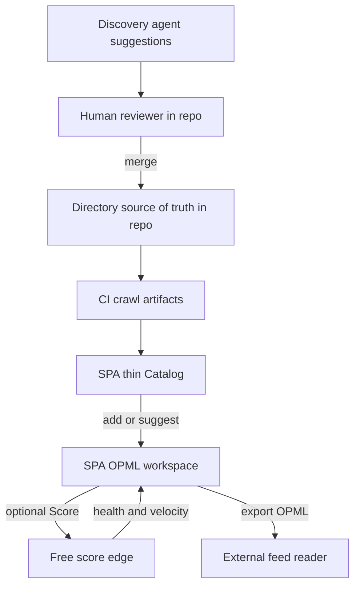
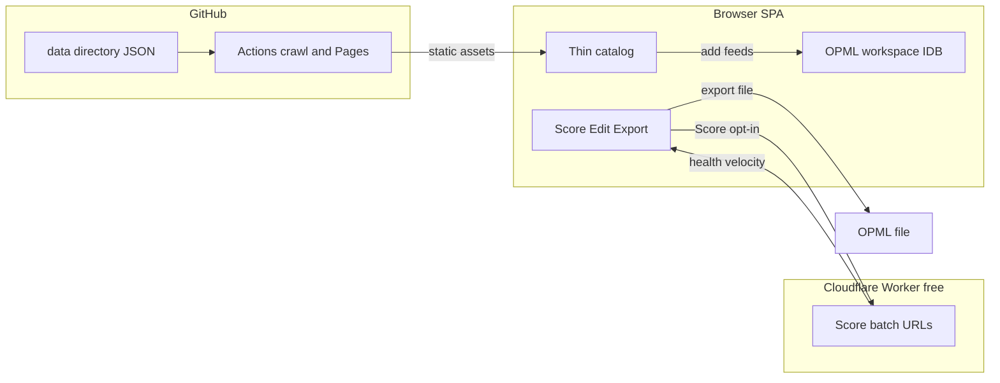
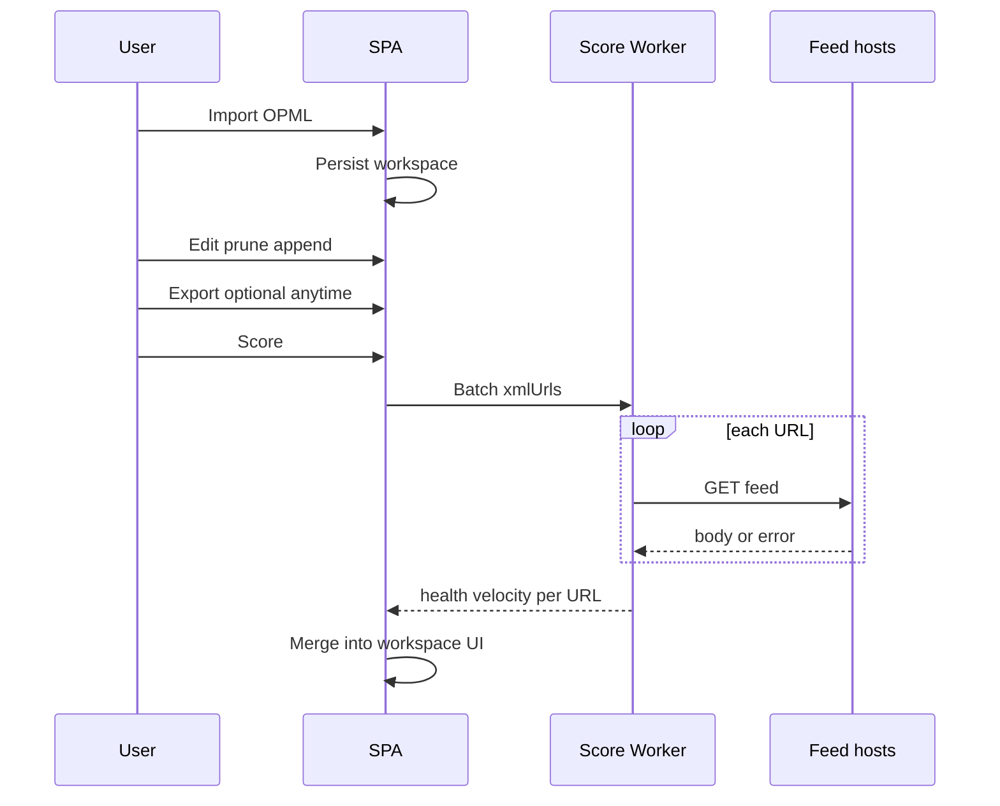

# DiveRSS Product - Plan

> Historical: written under the DiveRSS name; product is now GardenRSS.


## Goal Capsule

- **Objective:** Ship DiveRSS as a calm, local-first OPML workspace with a separately curated public directory as companion fuel for net-new builds and in-workspace suggestions—not as a feed reader.
- **Product authority:** This plan owns the DiveRSS **product** (directory + OPML workspace behavior and boundaries). Cursor cloud agents and Origin as a **dev/iteration workflow** are surrounding work, not active scope.
- **Open blockers:** None.

---

## Product Contract

### Summary

DiveRSS is an open-source, OPML-first workspace: import or build a subscription list, optionally run a user-triggered health+velocity score pass, prune/modify/append, and export into an existing reader. A curated public directory (owner, contributors, agent proposals gated in the repo) supplies discovery and alternatives; the SPA consumes only merged directory data. Persistence is Tabliss-like—browser-local, no accounts this release.

### Problem Frame

People who follow authors across readers carry an OPML list from tool to tool. Hand-maintained directories and exports grow weeds: time spent pruning, and broken feeds still land in the reader. Static “Awesome” lists do not score noise or help audit an existing export. A small cohort will keep needing portable list tools even if AI digests replace casual feed reading.

### Key Decisions

- KD1. **OPML workshop first** over peer or directory-first surfaces — keeps a calm single-purpose product while the directory remains companion fuel. (session-settled: user-directed — chosen over A peer / C directory-first: dogfood loop and Tabliss calm fit) Governs R1, R8.
- KD2. **Equal dual-primary actors** (list gardener and OPML owner) in one release — gardener value is delivered mainly via repo curation quality and catalog fuel, not a rich SPA curator console. (session-settled: user-directed — chosen over single-primary: both must feel complete) Governs R4, R5, R6.
- KD3. **Score = health + velocity** this release; Fever Hot Links deferred. (session-settled: user-directed — chosen over health-only / velocity-only / Hot Links now) Governs R2, R3.
- KD4. **Agent discovery = scaffolded suggestions with human repo gate**; SPA sees merged data only. (session-settled: user-directed — chosen over autonomous landings / in-app review queue) Governs R6.
- KD5. **Browser-local workspace + sync deferred**; Tabliss traits = local-first persistence and calm focused surface. (session-settled: user-directed — chosen over accounts this release) Governs R9.
- KD6. **Git/CI artifacts + client storage** for shared directory data; hosted DBs (D1 / Turso / Supabase·Neon) deferred. Ephemeral free edge compute for on-demand score is allowed and is not a database. (session-settled: user-directed — chosen over adopting a hosted DB now; later clarified that user Score needs server-side fetch) Governs R10, R13.
- KD7. **Not a feed reader** — manage and export only. (session-settled: user-directed) Governs R11.
- KD8. **Score is user-initiated** after an OPML is in the workspace; **export works whenever the OPML has been edited**, including before or without scoring. (session-settled: user-directed — chosen over join-only/unscored-only v1) Governs R2, R3, R1.

<!-- ce-section: work-relationships -->
### How This Work Fits Together

This plan owns **DiveRSS product** requirements. The broader kickoff also included **Cursor cloud agents + Origin workflow**; that remains a candidate follow-on brainstorm, not a committed roadmap.

- **DiveRSS product (this plan)**
  - **Enables:** meaningful use of a later agents/Origin workflow brainstorm (something concrete to iterate on)
  - **Can proceed independently of:** cloud-agents/Origin workflow design
- **Cursor cloud agents + Origin workflow (later candidate)**
  - **Depends on:** enough product shape to know what iteration loops matter (this plan)
  - **Shares:** human-gated agent proposals for directory discovery (product rule here; workflow may operationalize how agents run)
  - **Still to decide:** hosting on Origin vs GitHub-only, cloud agent loops, iteration cadence

### Actors

- A1. **OPML owner** — imports/exports personal subscription lists; needs optional Score, prune, modify, append.
- A2. **List gardener (owner)** — maintains the public curated directory for quality.
- A3. **Contributor** — proposes directory changes through the same human-gated repo path.
- A4. **Discovery agent (scaffolded)** — proposes directory adds/flags; never merges without human review.
- A5. **SPA user** — browses a thin catalog and works the OPML workspace; never reviews pending agent queues in-app this release.

### Requirements

**OPML workspace**

- R1. The primary product surface is an OPML workspace where a user can import an existing OPML, edit it (prune, modify, append), and export a usable OPML for an external reader. Export must work in v1 after edits, independent of whether Score has been run.
- R2. After an OPML is in the workspace, the user can **opt in** to a Score pass that attaches a **health** signal to each feed for dead/unreachable vs keep decisions.
- R3. The same user-initiated Score pass attaches a **velocity** signal (posting cadence / noise) for keep vs drop decisions before export.
- R9. Workspace state persists locally in the browser across refresh; import/export of OPML is the portability story. No accounts or hosted sync in this release.
- R13. On-demand Score must work for feeds in the user’s OPML even when those URLs are absent from the published directory index (browser cannot reliably fetch third-party feeds due to CORS).

**Directory companion**

- R4. A public curated directory exists as a **separate curation effort** from any one user’s OPML, with clear ownership by the project gardener.
- R5. Contributors can improve the directory through the human-gated repo path (same gate class as agent proposals).
- R7. The directory fuels two companion jobs: generate a **net-new** OPML from curated picks, and **surface alternatives / new feeds** to someone already working an OPML.
- R8. Catalog browse in the SPA is a **secondary** mode: thin filters/search sufficient to add or replace feeds—not a deep explore-first front door.

**Agentic discovery**

- R6. Scaffold an initial discovery function that emits directory suggestions for human review in the repo (PRs/issues or equivalent). Merged data only appears in the SPA.

**Delivery posture**

- R10. Shared non-secret directory and scheduled crawl artifacts publish via the repo/CI static pipeline; personal OPML state stays client-side. Hosted DB is out of this release. A free ephemeral score edge (no persistence of user OPML) is in scope to satisfy R13.
- R11. DiveRSS does not provide in-app article reading; success ends at a cleaner/richer OPML ready for an external reader.
- R12. Brand presents as DiveRSS with the scuba-mask icon affordance (Iconify/Tabler `scuba-mask`); mobile-first responsive layout.



### Key Flows

- F1. Audit and export existing OPML
  - **Trigger:** User imports an OPML file into the workspace.
  - **Actors:** A1, A5
  - **Steps:** Import; optionally run Score; prune/modify/append; optionally accept directory suggestions; export OPML at any time after edits; import into an external reader.
  - **Outcome:** Cleaner/richer OPML leaves DiveRSS; reading happens elsewhere.
  - **Covered by:** R1, R2, R3, R7, R9, R11, R13

- F2. Build net-new OPML from directory
  - **Trigger:** User starts from catalog picks rather than an existing file.
  - **Actors:** A1, A5
  - **Steps:** Browse thin catalog; add feeds into workspace; optionally Score; export OPML.
  - **Outcome:** Net-new subscription file grounded in curated directory.
  - **Covered by:** R1, R2, R3, R4, R7, R8, R13

- F3. Directory suggestion with human gate
  - **Trigger:** Discovery scaffold proposes adds/flags against the directory.
  - **Actors:** A4, A2 or A3
  - **Steps:** Agent emits proposal into repo review surface; human accepts/rejects; merge updates published artifacts; SPA catalog reflects merged data only.
  - **Outcome:** Directory quality improves without autonomous merges or in-app review queues.
  - **Covered by:** R4, R5, R6, R10

### Acceptance Examples

- AE1. Dead link prune
  - **Covers R1, R2, R11.**
  - **Given:** An OPML containing at least one unreachable feed.
  - **When:** The user runs Score, prunes using health, then exports.
  - **Then:** The exported OPML omits the pruned feed and is importable by an external reader; DiveRSS does not open items for reading.

- AE2. Velocity-informed keep/drop
  - **Covers R3.**
  - **Given:** Two reachable feeds with clearly different posting cadence.
  - **When:** The user runs Score on the OPML.
  - **Then:** Both show distinguishable velocity signals usable before export.

- AE3. Suggestion without SPA review queue
  - **Covers R6.**
  - **Given:** An agent proposal is open but not merged.
  - **When:** A user opens the SPA catalog.
  - **Then:** The pending proposal is absent; after merge and publish, the feed can appear as catalog/suggestion fuel.

- AE4. Local persistence
  - **Covers R9.**
  - **Given:** The user has an in-progress workspace after import/edits.
  - **When:** They refresh the browser (non-private, storage available).
  - **Then:** Workspace state is still present without signing in.

- AE5. Export without Score
  - **Covers R1, KD8.**
  - **Given:** An imported OPML edited (e.g. one feed removed) with Score never run.
  - **When:** The user exports.
  - **Then:** Export succeeds with the edited set; missing scores do not block export.

- AE6. Score URLs outside directory
  - **Covers R13, R2, R3.**
  - **Given:** An OPML feed URL absent from the published directory index.
  - **When:** The user runs Score.
  - **Then:** That feed receives health/velocity (or a clear per-feed failure), not a silent CORS failure in the browser.

### Success Criteria

- S1. **Primary loop:** A user can take an OPML in, optionally Score, use directory suggestions, and leave with a cleaner/richer OPML they import into a real reader.
- S2. **Dogfood:** The project owner uses DiveRSS on their own OPML and directory long enough to stop hand-weeding elsewhere as the default practice.
- S3. **Gardener completeness without SPA console:** Directory updates from owner/contributors/agent proposals land through the repo gate and show up as catalog fuel in the SPA.

### Scope Boundaries

**Deferred for later**

- Fever-style Hot Links / cross-feed link temperature
- Hosted sync / accounts
- Free-tier hosted DBs (Cloudflare D1, Turso, Supabase or Neon) if git/CI + local storage stop fitting
- Rich explore-first directory UX / deep category destination
- In-app review queue for pending agent suggestions
- Autonomous agent merges
- Cursor cloud agents + Origin **development** workflow (separate brainstorm)
- Moving the SPA off GitHub Pages onto Vercel/Deno as the primary host (unless free score edge proves insufficient)

**Outside this product's identity**

- Being a feed reader or replacement for Fever/FreshRSS/etc. as a reading surface
- Requiring accounts to get value from the OPML loop

### Deferred to Follow-Up Work

- Origin-hosted repo workflow and Cursor cloud agent iteration loops
- Optional future “submit URLs into directory crawl set” gardener tooling beyond the scaffold

### Dependencies / Assumptions

- External readers remain the consumption surface for exported OPML.
- A small author-following / OPML-portable cohort persists even if AI digests grow.
- Repo + CI can publish directory artifacts the SPA can load statically.
- A free Cloudflare Workers (or equivalent) tier can host a short-lived feed-fetch/score endpoint without storing user OPMLs.
- “Score” means feed-level health and velocity, not Fever Hot Links semantics.

### Outstanding Questions

**Deferred to Planning** — resolved below in Planning Contract KTDs where marked; remainder:

- None blocking.

**Resolve Before Planning**

- None.

### Sources / Research

- User PRD kickoff for DiveRSS (directory + OPML tools + CI health/velocity + static SPA posture).
- [Fever backup / posterity repo](https://github.com/mcaskill/fever) — Hot Links deferred, not v1 score.
- [Tabliss](https://tabliss.io/) — local-first calm surface reference.
- Planning research: browser CORS blocks trustworthy client-side third-party feed fetch; GitHub Pages Actions artifact deploy; gofeed + Vite/Vue Pages base/hash pitfalls; OPML 2.0 `text`+`xmlUrl` validation.

---

## Planning Contract

### Summary

Greenfield monorepo: Go shared scorer used by CI directory crawl and a free Cloudflare Worker for user-triggered Score; Vue 3 SPA on GitHub Pages for OPML-first workspace + thin catalog; IndexedDB for local workspace; agent discovery scaffold via repo PRs/issues.

### Product Contract preservation

restructured, no scope change: R2/R3/F1/AE1/AE2 clarified for user-initiated Score; AE5/AE6/R13 added; R10 allows ephemeral free score edge.

### Key Technical Decisions

- KTD1. **GitHub Pages for SPA + Cloudflare Worker for on-demand Score** over moving the whole app to Vercel/Deno Deploy. Pages keeps directory CI and static hosting on GitHub; Worker exists only because user Score needs server-side fetch under CORS. (session-settled: user-approved — chosen over pure Pages with unscored misses / full move to Vercel·Deno: free edge unlocks R13 while keeping Pages) Governs R10, R13.
- KTD2. **Shared score contract, dual runtime:** Go (`mmcdole/gofeed`) owns CI crawl. Cloudflare Worker implements the **same** health+velocity rules in TypeScript against a **golden fixture suite** checked in both runtimes (identical expected JSON for fixture feeds). No WASM/cross-compile required in v1.
- KTD3. **Health** = fetch success within timeout + parseable feed. **Velocity** = posts-per-week over a rolling 30-day window from item dates when dated items exist; otherwise an explicit “unknown velocity” state.
- KTD4. **Workspace storage = IndexedDB** (e.g. Dexie) for OPML/workspace; localStorage only for tiny prefs. OPML export remains the backup story per R9.
- KTD5. **Vue Router hash history** on project Pages (`base: '/<repo>/'`) to avoid SPA fallback issues on GitHub Pages.
- KTD6. **Directory source in git** (`data/`); scheduled Actions crawl writes versioned score/status JSON artifacts for catalog enrichment; do not grow unbounded commit history for per-run blobs when artifact/Pages publish suffices for derived snapshots.
- KTD7. **Agent scaffold = draft PR or issue against `data/`** with CODEOWNERS/required review; no auto-merge; SPA never reads pending proposals.
- KTD8. **Score Worker is ephemeral and hostile-input hardened:** accepts a bounded batch of feed URLs (max **25** per request; SPA chunks larger OPMLs), concurrency ≤**4**, returns per-URL results, does not store OPML or scores server-side. Rate-limit by IP (durable store, e.g. Cache/KV). Reject non-http(s), userinfo-bearing URLs, and private/metadata/link-local resolved IPs; re-validate after each redirect (≤3 hops). Cap response body size; never return upstream bodies. Errors use stable reason codes only. CORS allowlist = Pages origin + local Vite origins; **CORS is not authentication**.
- KTD9. **Free Worker CPU budget:** keep per-invocation work small (chunked Score). If free-tier CPU errors appear in dogfood, switch Score host to Deno Deploy or Vercel free functions with the same request/response contract—product behavior unchanged.

### Assumptions

- Project GitHub Pages URL shape (`https://<user>.github.io/diverss/`) is acceptable for v1.
- Cloudflare Workers free tier quotas cover dogfood + early open-source traffic; if not, swap to Deno Deploy/Vercel free functions without changing product behavior.
- Initial directory seed can be small (owner-curated) while agent scaffold is exercised.

### Alternative Approaches Considered

- **Join-only scores from CI JSON** — rejected; user required Score after OPML upload for arbitrary URLs.
- **Host SPA on Vercel/Deno with colocated functions** — deferred; more functionality overlap with Worker, but Pages+Actions already fit directory pipeline; revisit if dual-host friction bites.
- **GitHub Actions `workflow_dispatch` for Score** — slower UX, harder to pass private OPML safely; kept as fallback if Worker quotas fail.

### High-Level Technical Design





### Output Structure

```text
diverss/
  README.md
  data/
    directory.json          # curated feeds source of truth
    categories.json         # thin taxonomy if used
  cmd/
    diverss-crawl/          # Go CLI for CI directory crawl
  internal/
    score/                  # shared health + velocity logic
    opml/                   # OPML parse/serialize helpers if shared
  web/                      # Vue 3 + Vite + Tailwind SPA
    src/
  workers/
    score/                  # Cloudflare Worker entry
  scripts/
    discover-suggest/       # agent discovery scaffold
  .github/
    workflows/
      crawl.yml
      pages.yml
    CODEOWNERS
    PULL_REQUEST_TEMPLATE.md
  docs/
    plans/
```

Implementer may adjust layout if a cleaner split appears; per-unit **Files** lists remain authoritative.

### Risks & Dependencies

- **Worker free-tier abuse / open proxy** — SSRF denylist, batch/CPU caps, rate limits, no upstream body return (KTD8–KTD9).
- **Worker free-tier CPU** — chunked Score; Deno/Vercel contract-compatible fallback (KTD9).
- **Feed politeness** — timeouts, conditional GET where possible in CI; conservative concurrency.
- **Pages schedule inactivity** — document that public-repo scheduled Actions pause after inactivity; manual crawl dispatch remains.
- **Dual host config** — deploy Worker first; set public Score URL in SPA build env; rebuild Pages when URL changes.

### System-Wide Impact

- New public surfaces: GitHub Pages SPA and a public Score Worker (trust boundary: arbitrary URL fetch on behalf of callers).
- Failure propagation: Worker outage or rate-limit → SPA shows per-batch error; export and local edit remain available (AE5).
- Abuse posture: origin allowlist, batch caps, IP rate limits, no persistence of OPML; monitor Worker error/rate metrics on free tier dashboards.
- Contributors interact via git PRs for directory; end users never need GitHub accounts for the OPML loop.
- Agent scaffold writes only to review surfaces; never to live Pages data until human merge.

---

## Implementation Units

### U1. Monorepo scaffold and toolchains

- **Goal:** Create runnable empty shells for Go module, Vue app, Worker package, `data/`, and CI stubs.
- **Requirements:** R12 (brand hooks later), R10 foundation
- **Dependencies:** None
- **Files:** `go.mod`, `cmd/diverss-crawl/main.go` (stub), `web/package.json`, `web/vite.config.ts`, `workers/score/`, `data/directory.json`, `README.md`, `.github/workflows/pages.yml` (stub)
- **Approach:**
  1. Init Go module and Vue (`create vue`) with Tailwind Vite plugin and Iconify.
  2. Pin Vite `base` for project Pages; hash router.
  3. Seed minimal `directory.json` schema with `schemaVersion`.
- **Patterns to follow:** Official Vite GitHub Pages deploy notes; Tailwind v4 Vite plugin.
- **Test scenarios:**
  - `Test expectation: none -- scaffolding only; smoke in U3/U5.`
- **Verification:** `go build ./...` and `web` install/build succeed locally with documented commands in README.

### U2. Shared feed score engine (Go)

- **Goal:** Implement health + velocity scoring used by CI and documented for the Worker path.
- **Requirements:** R2, R3, KTD2, KTD3
- **Dependencies:** U1
- **Files:** `internal/score/*.go`, `internal/score/*_test.go`, `cmd/diverss-crawl/main.go`, `testdata/feeds/*`, `testdata/score-golden/*.json`
- **Approach:**
  1. Fetch with context timeouts, identifiable UA, optional ETag/Last-Modified cache for CI.
  2. Parse via gofeed; compute health and 30-day posts/week velocity.
  3. Emit versioned JSON records keyed by `xmlUrl`.
  4. Check in fixture feed bodies + golden expected score JSON for Worker/Go parity (KTD2).
- **Execution note:** Implement score pure functions test-first before HTTP wiring.
- **Test scenarios:**
  - Happy path: dated items over 30 days → expected posts/week within tolerance.
  - Edge: no dated items → unknown velocity, healthy if parse OK.
  - Edge: empty item list → healthy if parse OK, velocity unknown (KTD3).
  - Error: timeout / non-200 / unparseable body → unhealthy with reason code.
  - Integration: golden fixture body → matches `testdata/score-golden` output.
- **Verification:** Go tests green; CLI scores a fixture feed URL list to stdout/file.

### U3. Directory crawl CI + Pages publish

- **Goal:** Schedule crawl of `data/directory.json` and deploy SPA + static data to GitHub Pages.
- **Requirements:** R4, R10, KTD6
- **Dependencies:** U1, U2
- **Files:** `.github/workflows/crawl.yml`, `.github/workflows/pages.yml`, `data/`, `web/` build wiring
- **Approach:**
  1. Prefer a **single workflow** (or crawl job that uploads an artifact consumed by the Pages job): crawl `data/directory.json`, then build SPA and publish via `upload-pages-artifact` + `deploy-pages` so derived status ships with the site without unbounded git blob history.
  2. Document the stable SPA path for directory/status JSON (e.g. under the Pages base `/diverss/data/...`).
  3. Manual `workflow_dispatch` for crawl+publish.
- **Test scenarios:**
  - Integration: fixture directory → published JSON contains `schemaVersion` and per-feed health fields at the documented path.
  - Error: one bad URL does not abort entire crawl batch.
- **Verification:** Workflows documented; manual dispatch produces artifacts; Pages URL serves `index.html` and directory JSON.

### U4. On-demand Score Worker

- **Goal:** Free Cloudflare Worker accepts a bounded URL batch and returns health+velocity without persisting OPML.
- **Requirements:** R2, R3, R13, KTD1, KTD2, KTD8
- **Dependencies:** U2 (golden fixtures + KTD3 definitions)
- **Files:** `workers/score/*`, `workers/score/*_test.ts`, `testdata/feeds/*`, `testdata/score-golden/*.json`, Worker deploy config
- **Approach:**
  1. POST JSON `{ urls: string[] }` with max batch **25**; concurrency ≤**4**; parallel fetch with per-URL timeout and global batch wall-clock.
  2. Implement KTD3 rules in TypeScript; assert Worker and Go both match `testdata/score-golden` for the same fixture bodies.
  3. Apply KTD8 URL/IP/redirect/body/CORS controls; identifiable User-Agent with contact; never return upstream feed bodies.
  4. Never log full request URL lists or POST bodies in observability.
- **Execution note:** Golden-vector tests first; network smoke optional behind a flag.
- **Test scenarios:**
  - Happy path: two fixture URLs → both scored.
  - Integration: Worker output equals golden JSON for fixture body A (parity with Go).
  - Edge: empty batch → 400; over max batch → 400.
  - Error: upstream failure → per-URL reason code only, mixed results OK.
  - Covers AE6: URL not in directory still scored.
  - Security: metadata/private IP URL → blocked; oversize body → per-URL error; response contains no upstream body bytes.
- **Verification:** Deployed Worker URL documented; curl fixture returns schema-stable JSON; golden suite green in Go and Worker CI.

### U5. OPML workspace SPA (import, edit, persist, export)

- **Goal:** Calm OPML-first UI with IndexedDB persistence and export that never depends on Score.
- **Requirements:** R1, R9, R11, R12, KTD4, KTD5, KD8
- **Dependencies:** U1
- **Files:** `web/src/**`, `web/src/**/*.spec.ts` (or project test runner), OPML parse/serialize modules
- **Approach:**
  1. Import OPML via `DOMParser`; require feed outlines with `text` + `xmlUrl`.
  2. Prune/modify/append in workspace; persist to IndexedDB.
  3. Export via `XMLSerializer` / DOM build; download file.
  4. Brand: DiveRSS + scuba-mask icon; mobile-first layout; secondary nav stub for Catalog.
- **Execution note:** Round-trip tests first for OPML parse/serialize.
- **Test scenarios:**
  - Happy path: import sample OPML → N feeds visible.
  - Covers AE5: edit without Score → export omits pruned feed.
  - Edge: malformed XML → user-visible error, no crash.
  - Edge: outline missing `xmlUrl` → rejected or flagged, not silently kept as feed.
  - Covers AE4: reload restores workspace from IDB.
  - Covers AE1 export half: exported file has well-formed OPML structure.
- **Verification:** Local SPA supports import → edit → export; persistence survives refresh.

### U6. User-triggered Score UX

- **Goal:** Wire Score button to Worker and merge results into workspace rows.
- **Requirements:** R2, R3, R13, F1, AE1, AE2, AE6
- **Dependencies:** U4, U5
- **Files:** `web/src/**` score client, UI row states, env for Worker URL
- **Approach:**
  1. Chunk workspace `xmlUrl`s into ≤25 URL batches; show progress across chunks.
  2. Display health + velocity; allow prune based on signals.
  3. Score failure must not block export.
- **Test scenarios:**
  - Covers AE2: mocked Worker returns two velocities → UI distinguishes them.
  - Covers AE1: unhealthy feed marked; after prune, export drops it.
  - Error: Worker unreachable → toast/error; export still enabled.
  - Edge: Score twice → latest results replace prior score fields.
  - Edge: OPML with >25 feeds → multiple Worker calls; all rows eventually updated or failed per-URL.
- **Verification:** Against deployed or mocked Worker, Score populates columns; export still works on failure.

### U7. Thin catalog companion

- **Goal:** Secondary Catalog mode loads published directory, filters lightly, adds feeds into workspace / suggests alternatives.
- **Requirements:** R4, R7, R8, F2
- **Dependencies:** U3, U5
- **Files:** `web/src/**` catalog views, `data/directory.json` schema consumers
- **Approach:**
  1. Fetch static directory JSON from Pages.
  2. Search/filter by title/category/tags if present.
  3. Add to workspace; simple “alternatives” = same category or tag overlap (keep thin).
- **Test scenarios:**
  - Happy path: add catalog feed → appears in workspace OPML export.
  - Edge: empty directory → empty state, no crash.
  - Integration: workspace already has feed → add duplicate is no-op or flagged.
- **Verification:** Catalog usable on Pages build; does not become default landing over workspace.

### U8. Agent discovery scaffold

- **Goal:** Minimal discovery script + PR/issue path so agents propose directory changes for human review.
- **Requirements:** R5, R6, F3, AE3, KTD7
- **Dependencies:** U1, directory schema from U3
- **Files:** `scripts/discover-suggest/**`, `.github/PULL_REQUEST_TEMPLATE.md`, `.github/CODEOWNERS`, `docs/` or README section
- **Approach:**
  1. Script reads current `data/directory.json`, emits suggestion markdown or branch diff candidates (heuristic/stub OK for v1).
  2. Document human merge gate; forbid auto-merge.
  3. Confirm SPA only loads merged published data (no pending queue UI).
- **Test scenarios:**
  - Happy path: script runs on fixture directory → writes suggestion artifact without modifying `main` data.
  - Covers AE3: documenting/asserting catalog fetch ignores unmerged paths (no pending endpoint).
- **Verification:** README describes agent → PR → merge → Pages refresh loop; CODEOWNERS present.

---

## Verification Contract

| Gate | Applies to | Signal |
|---|---|---|
| Go unit tests | U2 | `go test ./...` |
| Web unit/component tests | U5, U6, U7 | package test runner in `web/` |
| Worker tests | U4 | worker package test / vitest |
| OPML round-trip fixtures | U5 | import→export structural checks |
| Manual dogfood | U5–U7 | owner OPML through Score + export into a real reader |
| Pages + Worker smoke | U3, U4, U6 | production URLs return SPA and score JSON |
| Agent scaffold dry-run | U8 | script on fixture + PR template exists |

---

## Definition of Done

- All Implementation Units U1–U8 complete with their verification signals.
- AE1–AE6 behaviors demonstrable on the deployed SPA + Worker.
- Export works after edits without requiring Score.
- Directory crawl CI and Pages deploy documented and runnable.
- Agent discovery scaffold documented with human merge gate; no auto-merge.
- README covers dogfood path: import → optional Score → prune → export → reader.
- No in-app reader UI shipped.
- Product Contract R-IDs remain the behavior authority; KTDs match deployed architecture.
