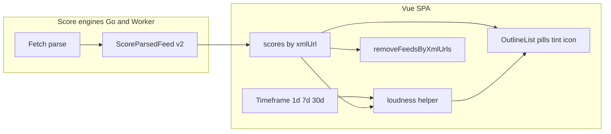

# Score Stale Status and Signal Triage - Plan

## Goal Capsule

- **Objective:** Upgrade DiveRSS Score so OPML owners can spot dormant feeds, bulk-prune them, and triage remaining feeds by an absolute loudness signal tuned with a list-level timeframe.
- **Product authority:** This plan owns Score **status, cadence/signal presentation, and prune actions** in the OPML workspace. Broader DiveRSS product shape remains in `docs/plans/2026-08-24-001-feat-diverss-product-plan.md`.
- **Open blockers:** None.

---

## Product Contract

### Summary

After Score, each feed is **Unhealthy**, **Stale**, or **Healthy**. Stale means reachable and parseable but with no dated posts in **90 days**; the label shows last-post age. Warning rows use a colored highlight. Healthy feeds show an **absolute loudness score** (icon + 0–100; Low/Medium/High in the tooltip) from cadence in a user-selected timeframe × average words (best-available item body). A control **outside the feed list** sets the timeframe for all rows without changing the Stale rule. Users can **remove all Stale feeds** in one action, then export.

### Problem Frame

Today Score treats fetch+parse success as Healthy even when the newest item is many months old, and shows a hard-to-read `posts/wk` float (e.g. Healthy + `0.00`). List gardeners need dormancy as a first-class prune signal and a triage readout that answers “how loud will this feed be?” in real time.

### Key Decisions

- KD1. **Third status Stale** — separate from Healthy and Unhealthy. (session-settled: user-directed — chosen over Healthy-with-label-only or folding into Unhealthy) Governs R1, R2.
- KD2. **One Stale status with age in the label** — not separate Quiet/Dormant pills. (session-settled: user-directed — chosen over two severity pills or dual labels without one prune bucket) Governs R2, R4.
- KD3. **Stale = no dated posts in the last 90 days** (reachable + parseable + at least one dated item ever, all older than 90d). (session-settled: user-directed — chosen over 30-day threshold) Governs R1.
- KD4. **Full triage pack** — period counts as score inputs, signal score, and average word count in one Score pass. (session-settled: user-directed — chosen over Stale+periods-only or Stale+signal without words) Governs R5, R6, R7.
- KD5. **Single absolute loudness score** combining cadence + length — not projected-volume-only copy and not relative-within-OPML ranking. (session-settled: user-directed — chosen over projected volume / both / relative percentile) Governs R6, R8.
- KD6. **Icon + number in-row; Low/Medium/High in tooltip.** (session-settled: user-directed — refined from band+number inline) Governs R6.
- KD7. **Word count from best-available item text** — prefer full content when present, else description/summary. (session-settled: user-directed — chosen over description-only or title+description) Governs R7.
- KD8. **List-level timeframe control** reshapes cadence/signal for all Healthy rows; **does not** change the 90-day Stale rule. (session-settled: user-directed — chosen over per-row multi-window display and over coupling Stale to the selected window) Governs R8, R1.
- KD9. **Row highlight for warning statuses** to raise visibility. (session-settled: user-directed) Governs R3.
- KD10. **Bulk remove all Stale** action in the workspace. (session-settled: user-directed) Governs R4.

<!-- ce-section: work-relationships -->
### How This Work Fits Together

This plan owns the **Score stale + signal triage** slice. Parent product plan: `docs/plans/2026-08-24-001-feat-diverss-product-plan.md` (health + velocity Score remains the umbrella; this plan replaces velocity presentation and adds Stale).

- **Score stale + signal (this plan)**
  - **Depends on:** existing user-initiated Score pass and OPML workspace (parent plan R1–R3, R13)
  - **Enables:** clearer prune-before-export dogfood
  - **Can proceed independently of:** catalog UX, agent discovery scaffold, Fever Hot Links
- **Parent DiveRSS product**
  - **Shares:** Score = keep/drop aid, not a reader; export without Score still required
- **Later candidates (not active scope)**
  - Relative/percentile loudness, Fever Hot Links, bulk-remove Unhealthy, sync/accounts

### Actors

- A1. **OPML owner** — runs Score, scans Stale/Unhealthy highlights, adjusts timeframe, bulk-removes Stale, prunes by signal, exports.

### Requirements

**Status and prune**

- R1. After Score, a feed that is reachable and parseable with at least one dated item, and **no dated items in the last 90 days**, is status **Stale** (not Healthy). Feeds with no dated items remain a non-Stale unknown-cadence case (not forced Stale).
- R2. Stale presentation uses one pill/status; the visible label (or adjacent copy) includes **last-post age** (e.g. last post 16mo ago).
- R3. Warning statuses use a **colored row highlight** so Stale (and Unhealthy) stand out in the list without relying on the pill alone.
- R4. The workspace offers an action to **remove all Stale feeds** from the current OPML in one step; per-feed remove remains available. Export after bulk remove does not require re-Score.

**Signal and cadence**

- R5. The Score pass records post counts for **1-day, 7-day, and 30-day** windows (and enough data for the fixed 90-day Stale rule) plus **average word count** over dated items used for burden, using best-available item text per KD7.
- R6. Healthy feeds show an **absolute loudness score**: in-row **icon + 0–100 number**; tooltip explains the **Low / Medium / High** band and briefly what the score means. Stale and Unhealthy do not present a competing “healthy loudness” as the primary action cue.
- R7. Average word count contributes to the loudness score; when no usable text exists, the score still works from cadence with an explicit unknown-burden handling (planning chooses the exact fallback).
- R8. A **timeframe control outside the feed list** (options: **1d / 7d / 30d**) selects which cadence window drives loudness for **all** Healthy rows. Changing timeframe must not require a new fetch when Score results already include the window counts. Timeframe never changes Stale classification (R1).

**Continuity**

- R9. Unreachable / unparseable feeds remain **Unhealthy** with existing reason codes; Stale is only for successful fetch+parse dormancy.
- R10. Export remains available without Score; Score remains user-initiated.

### Key Flows

- F1. Score then prune Stale
  - **Trigger:** OPML owner runs Score on a workspace with dormant feeds (e.g. Touch Arcade–class).
  - **Actors:** A1
  - **Steps:** Score completes; dormant reachable feeds show Stale + age + row highlight; owner uses remove-all-Stale (or per-feed remove); exports OPML.
  - **Outcome:** Stale feeds are gone from export; Healthy/Unhealthy handling unchanged except presentation.
  - **Covered by:** R1, R2, R3, R4, R9, R10

- F2. Triage by timeframe + loudness
  - **Trigger:** After Score, owner wants to know which Healthy feeds will be noisy.
  - **Actors:** A1
  - **Steps:** Owner sets list timeframe (1d/7d/30d); all Healthy rows update loudness icon+number from stored window data; owner scans tooltips and prunes high-loudness feeds individually; exports.
  - **Outcome:** Same Score results support multiple triage windows without re-fetch.
  - **Covered by:** R5, R6, R7, R8

### Acceptance Examples

- AE1. Touch Arcade–class dormancy
  - **Covers:** R1, R2, R3
  - **Given:** Feed fetches and parses; newest dated item is older than 90 days.
  - **When:** Owner runs Score.
  - **Then:** Status is Stale (not Healthy); label includes last-post age; row uses warning highlight; no primary Healthy loudness cue.

- AE2. Bulk remove Stale
  - **Covers:** R4
  - **Given:** Workspace has multiple Stale feeds after Score.
  - **When:** Owner runs remove-all-Stale.
  - **Then:** All Stale feeds are removed; other feeds remain; export works without re-Score.

- AE3. Timeframe reinterpretation
  - **Covers:** R5, R6, R8
  - **Given:** Score results include 1d/7d/30d counts for a Healthy feed.
  - **When:** Owner switches timeframe from 7d to 1d.
  - **Then:** Loudness icon+number update without a new Score fetch; Stale set is unchanged.

- AE4. Word burden in loudness
  - **Covers:** R6, R7
  - **Given:** Two Healthy feeds with similar post counts in the selected window; one has much higher average words from full content.
  - **When:** Owner views loudness at that timeframe.
  - **Then:** The longer feed scores higher (or equal only if cadence dominates under the planned formula); tooltip still exposes Low/Medium/High.

### Scope Boundaries

- **In scope:** Stale status + age copy; warning row highlights for **Unhealthy and Stale**; bulk remove Stale; multi-window cadence inputs; absolute loudness (icon + number + tooltip bands); avg words from best-available body; list-level 1d/7d/30d control (default **7d**); Go/Worker/SPA contract alignment for the new score fields.
- **Out of scope:** Relative/percentile loudness; Fever Hot Links; bulk-remove Unhealthy; making dormancy an Unhealthy reason; feed reading UI; changing the 90-day Stale rule via timeframe; accounts/sync.
- **Assumption:** Unhealthy and Stale share a warning row tint family (Unhealthy may use a stronger red tint); bulk action remains Stale-only.
- **Assumption:** Timeframe control options are exactly **1d / 7d / 30d**.

### Success Criteria

- A dormant-but-reachable feed is never shown as Healthy with `0.00 posts/wk`-style false comfort.
- Owner can clear all Stale feeds in one action and export.
- Owner can switch timeframe and re-rank loudness across the list without re-running Score.
- Loudness is scannable (icon + number) with band meaning available on demand.
- Unhealthy rows are visibly highlighted for local dogfood before/while Stale lands.

### Outstanding Questions

None blocking. Deferred items resolved in Planning Contract KTDs below.

---

## Planning Contract

### Summary

Bump the shared Score JSON to **schemaVersion 2** with `health: ok | stale | unhealthy`, multi-window post counts, avg words, and last dated timestamp. SPA computes absolute loudness client-side from the selected timeframe (default **7d**). Ship **Unhealthy row highlights first** (U1) for local verification against today’s Worker, then engine + Stale + loudness + bulk prune.

### Product Contract preservation

unchanged

### Key Technical Decisions

- KTD1. **`schemaVersion: 2`** across Go, Worker, SPA, and goldens. Replace single-window `postsPerWeek` / `itemCountWindow` with `posts1d`, `posts7d`, `posts30d`, optional `avgWords`, optional `lastDatedAt` (ISO UTC), and `health` ∈ `{ok, stale, unhealthy}`. Add reason `stale` when health is stale. Keep existing unhealthy reason codes. Governs R1, R5, R9.
- KTD2. **Stale computed in ScoreParsedFeed** when `anyDated && posts in last 90d == 0`; undated feeds stay `health=ok` with `velocityUnknown`-equivalent (`cadenceUnknown: true` or reuse `velocityUnknown` renamed only if both runtimes change together — prefer keep `velocityUnknown` for undated to minimize churn). Governs R1.
- KTD3. **Loudness is SPA-only** from stored window counts + `avgWords`; engines do not emit 0–100. Default timeframe **7d**. (session-settled: user-approved — chosen over 1d/30d default) Governs R6, R8.
- KTD4. **Absolute loudness formula (v1):** normalize selected-window posts to an estimated posts-per-day `p = posts / days` (1 / 7 / 30). `cadence = min(100, round(p * 50))` (2 posts/day → 100). Burden: if `avgWords` missing/0 → factor `1.0` and tooltip notes unknown length; else `burden = clamp(avgWords / 400, 0.6, 1.8)`. `score = min(100, round(cadence * burden))`. Bands: Low `0–33`, Medium `34–66`, High `67–100`. Document in tooltip. Governs R6, R7; resolves OQ1/OQ3.
- KTD5. **Word text:** strip tags from best-available body (content/encoded or Atom content → description/summary); whitespace-split word count; average over dated items that contributed any text (skip empty). Worker `ParsedItem` must carry optional text fields; Go uses gofeed content/description. Shared goldens with HTML bodies. Governs R7.
- KTD6. **Age copy:** from `lastDatedAt` — `<1d` → “today”; `<30d` → “Nd ago”; `<365d` → “Nmo ago”; else “Ny ago” (floor). Governs R2; resolves OQ4.
- KTD7. **Icons:** `@iconify/vue` Tabler — Low `tabler:volume-2`, Medium `tabler:volume`, High `tabler:volume-3` (or equivalent volume ladder). Governs R6; resolves OQ2.
- KTD8. **Bulk prune:** `removeFeedsByXmlUrls(doc, urls: Set|string[])` walks/clones outline tree and drops matching feeds; do not loop `removeAtPath` (index shift). Workspace collects Stale `xmlUrl`s from score map, calls once, drops those keys from `scores`. Governs R4.
- KTD9. **Sequencing for dogfood:** U1 Unhealthy highlight ships against current schema so local Score can verify tint before schema v2. Stale highlight reuses the same row-tint helper with a distinct class. (session-settled: user-directed — start with Unhealthy for local verify)

### Assumptions

- Truncated RSS (few items, all old) may false-Stale; same class of limit as today’s 30d window — acceptable for v1.
- No persisted Score in IndexedDB; schema bump needs no client migration beyond clearing in-memory map on re-Score.
- `postsPerWeek` removal is OK; SPA stops rendering it once v2 lands.

### Alternative Approaches Considered

- **Relative loudness within OPML** — rejected in brainstorm (approach B).
- **Recompute loudness on Worker when timeframe changes** — rejected; wastes fetch budget; windows already in result.
- **Loop `removeAtPath` for bulk Stale** — rejected; sibling index corruption risk.

### High-Level Technical Design

## Implementation Units

Ordered for dogfood: **U1 first** (Unhealthy tint against today’s Worker), then engine v2, SPA loudness, Stale UI, bulk prune, CLI polish.

### U1. Unhealthy row highlight (dogfood first)

- **Goal:** Make Unhealthy feeds visually obvious with a row tint so local Score dogfood can verify warning visibility before schema v2.
- **Requirements:** R3, R9
- **Dependencies:** None
- **Files:**
  - Modify: `web/src/components/OutlineList.vue`
  - Create: `web/src/components/OutlineList.warning.spec.ts` (or colocated vitest)
- **Approach:**
  1. When `scores[xmlUrl].health === 'unhealthy'`, apply a light red/rose background (+ optional left border) on the feed row/`li`/`article`.
  2. Extract a small `rowWarningClass(score)` helper in the component (or `web/src/score/presentation.ts`) so Stale can reuse it in U4.
  3. Keep existing Unhealthy pill + reason tooltip.
- **Execution note:** Prefer install/runtime smoke on Vite after unit tests; this unit alone is enough for local Unhealthy verify.
- **Patterns to follow:** Existing pill classes in `OutlineList.vue`; Tailwind slate/teal/red palette already used.
- **Test scenarios:**
  - Unhealthy score → row includes warning class; Healthy/unscored → no warning class.
  - Reason tooltip still present on Unhealthy pill.
- **Verification:** `npm run test:unit` in `web/`; manual Score on a blocked/bad URL shows tinted row.

### U2. Score schema v2 + Stale + windows + words (Go + Worker + goldens)

- **Goal:** Dual runtimes emit identical v2 Score JSON including Stale and cadence/word inputs.
- **Requirements:** R1, R5, R7, R9
- **Dependencies:** None (parallelizable with U1)
- **Files:**
  - Modify: `internal/score/score.go`, `internal/score/fetch.go`, `internal/score/score_test.go`
  - Modify: `workers/score/src/types.ts`, `workers/score/src/score.ts`, `workers/score/src/parse.ts`, `workers/score/src/index.test.ts`
  - Modify/create: `testdata/feeds/*.xml`, `testdata/score-golden/*.json`
- **Approach:**
  1. Bump `SchemaVersion` / `SCHEMA_VERSION` to 2; extend `HealthStatus` with `stale`; add reason `stale`.
  2. Count dated items in 1d/7d/30d/90d; set `posts1d|7d|30d`; if anyDated and 90d count is 0 → `health=stale`, `reason=stale`, set `lastDatedAt`.
  3. Compute `avgWords` per KTD5; omit or null when no text.
  4. Drop or stop asserting `postsPerWeek` / `itemCountWindow` in goldens.
  5. Keep golden parity: same expected JSON (ignore `scoredAt`) in Go + Worker tests.
- **Execution note:** Implement formula/tests first against fixtures; add a stale fixture with dated items older than 90d relative to a frozen `now` in tests.
- **Patterns to follow:** Existing `ScoreParsedFeed` + Worker mirror; `TestGoldenFixtureFile` / Worker golden test.
- **Test scenarios:**
  - Covers AE1. Fixture with last item >90d before frozen now → `health=stale`, `reason=stale`, `lastDatedAt` set, posts windows 0.
  - Undated items only → `health=ok`, `velocityUnknown=true`, not stale.
  - Mixed ages → correct posts1d/7d/30d counts.
  - Content-encoded HTML vs description-only → avgWords prefers full content; Go/Worker match within rounding.
  - Unparseable/fetch fail → unhealthy unchanged.
- **Verification:** `go test ./internal/score/...`; `npm test` / vitest in `workers/score`.

### U3. SPA score client + loudness helper + timeframe control

- **Goal:** Consume v2 results; default timeframe 7d; compute icon band + score without re-fetch.
- **Requirements:** R5, R6, R7, R8
- **Dependencies:** U2 (types); UI can stub until Worker deployed locally
- **Files:**
  - Modify: `web/src/score/client.ts`, `web/src/score/client.spec.ts`
  - Create: `web/src/score/loudness.ts`, `web/src/score/loudness.spec.ts`
  - Modify: `web/src/views/WorkspaceView.vue`
- **Approach:**
  1. Align `ScoreResult` with v2 fields.
  2. Implement KTD4 in `loudness.ts` (`scoreFor`, `bandFor`, tooltip text).
  3. Workspace state: `timeframe: '1d'|'7d'|'30d'` default `'7d'`; control above outline list (segmented buttons or select).
  4. Pass `timeframe` into `OutlineList`.
- **Patterns to follow:** Existing `scoreUrls` chunking; Tailwind control styles near Score button row.
- **Test scenarios:**
  - Covers AE3. Same result, switch 7d→1d → score changes when counts differ; no network.
  - Missing avgWords → burden 1.0; band still assigned.
  - Band cutovers at 33/34 and 66/67.
- **Verification:** `npm run test:unit` in `web/`.

### U4. OutlineList Stale + loudness presentation

- **Goal:** Third status pill with age; Stale/Unhealthy tints; Healthy shows icon+number; remove `posts/wk`.
- **Requirements:** R1, R2, R3, R6
- **Dependencies:** U1, U3
- **Files:**
  - Modify: `web/src/components/OutlineList.vue`
  - Modify: `web/src/score/presentation.ts` (if created in U1) / age helper
  - Create/modify: presentation unit tests
- **Approach:**
  1. Pills: Healthy / Stale (with age) / Unhealthy (reason tooltip) / Unscored.
  2. Stale row tint (amber/warm) distinct from Unhealthy red; share helper API.
  3. Healthy: Iconify volume icon + number; `title` tooltip with Low/Medium/High + short legend.
  4. No loudness primary cue on Stale/Unhealthy.
- **Patterns to follow:** FeedAvatar layout; existing pill ring styles; `@iconify/vue` as in `App.vue`.
- **Test scenarios:**
  - Covers AE1. Stale result → Stale pill + age substring + warning tint; no loudness icon.
  - Healthy with posts → icon+number present.
  - Unhealthy still red-tinted (regression from U1).
- **Verification:** Unit tests + manual Workspace Score against Touch Arcade–class URL after Worker v2.

### U5. Bulk remove Stale

- **Goal:** One action removes all Stale feeds from the OPML.
- **Requirements:** R4, R10
- **Dependencies:** U2 (Stale in scores), U4 (optional UX polish)
- **Files:**
  - Modify: `web/src/opml/mutate.ts`, `web/src/opml/opml.spec.ts`
  - Modify: `web/src/views/WorkspaceView.vue`
- **Approach:**
  1. Add `removeFeedsByXmlUrls` per KTD8.
  2. Workspace button “Remove all stale” enabled when any score has `health==='stale'`; confirm optional (keep simple: click removes).
  3. Clear removed urls from `scores`; status toast with count.
- **Patterns to follow:** Existing `prune` / `removeAtPath`; export independence.
- **Test scenarios:**
  - Covers AE2. Doc with nested Stale urls → all matching feeds gone; folders retained if non-empty; non-stale feeds remain.
  - Empty url set → doc unchanged.
  - Export after bulk remove serializes without removed feeds.
- **Verification:** `npm run test:unit`; manual bulk remove then Export OPML.

### U6. Crawl CLI / formatting parity

- **Goal:** CI crawl and CLI lines don’t assume postsPerWeek-only formatting.
- **Requirements:** R5, R9
- **Dependencies:** U2
- **Files:**
  - Modify: `cmd/` / workflows that embed score fields as found by grep after U2
- **Approach:** Print health + stale/windows summary consistent with v2; avoid breaking JSON artifact consumers if directory enrichment reads score fields — grep and update.
- **Test expectation:** none beyond updating any broken compile/tests from U2 — smoke `go test ./...`.
- **Verification:** `go test ./...`; `go build ./cmd/...`.

## Verification Contract

- **Go:** `go test ./internal/score/...` and `go test ./...`
- **Worker:** `cd workers/score && npm test` (or project’s vitest script)
- **Web:** `cd web && npm run test:unit && npm run type-check`
- **Manual dogfood:** Vite + Wrangler; Score Unhealthy tint (U1); then v2 Stale (Touch Arcade), timeframe switch, bulk remove, export.
- **Quality gates:** Go+Worker golden fixtures must match; no SPA reliance on `postsPerWeek`.

## Definition of Done

- All units U1–U6 complete with listed tests green.
- Product Contract R1–R10 satisfied in SPA against local Worker.
- Unhealthy highlight verified locally (user) before or as part of U1 acceptance.
- README / score docs mention schema v2 fields if they currently document postsPerWeek (update if present).
- No Fever Hot Links / relative score / bulk Unhealthy creep.
